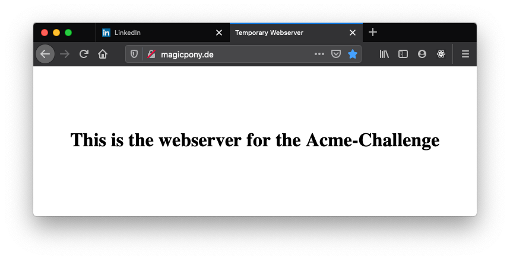

# Use Apache and SSL/Let's Encrypt in Docker

This article is about:
* setting up an Apache Webserver in an Alpine Linux Docker Container
* setting up a SSL encryption via Let's Encrypt

Requirements:
* Basic understanding of docker and docker-compose
* Basic understanding of Apache

Structure of Blog Article:
1) My Motivation for Docker usage and this article
2) Temporary Apache Container for handshaking with Let's Encrypt, a free SSL certificate service
3) Getting the Certificates via Certbot Docker Container
4) Spinning up the Production Apache Server 

## 1) Motivation
For my website consisting of a blog and some webapplications I would like to migrate the existing application logic and static files into seperated docker containers to &nbsp;&nbsp; **streamline the development process, the testing and the operation of the production system**  &nbsp;&nbsp; Docker allows to isolate parts of my website into decoupled units which can be treated seperately from each other. I would then be able to try out smaller technical adjustments on specific parts, such as &nbsp;&nbsp;**security adjustments**&nbsp; . In the past it happened that e.g. a change of filters in mod_security lead to negative sideeffects on a app that I host (with target of 24/7 availablity), whereas the setting was intended to harden the blogging part of my website. One of the &nbsp;&nbsp;huge advantages that comes with Microservices and Dockerization is that you are much more flexible in your sourcing decisions. In my private context this means I can today host my website in the **Tencent Cloud**, but would be able to easily shift a single service or the whole website to another supplier, such as **Amazon Web Services** when I move back to Europe. 

I found [this perfect Article on setting up everything for Nginx](https://www.humankode.com/ssl/how-to-set-up-free-ssl-certificates-from-lets-encrypt-using-docker-and-nginx) . The motivation to write this article is mainly driven for documentation reasons. What's more: It seems like there is no tutorial for doing such kind of steps for Apache based webservers. I suggest you read through his article for the background information and just come back here, if you want to set up everything for Apache. 

## 2) Temporary Apache

The temporary Apache has the only purpose for exposing a temporary website over http / port 80. This website will be used by the certbot and the triggered ACME-Challenge later. For preparing it you need those files:


[Better download the files from github, if you want to get your hands dirty. You will find the latest files there. Feel free to submit pull requests.](https://github.com/Spansky/apache-and-letsencrypt )

<details><summary>index.html (click to see the content)</summary>

```html
<!DOCTYPE html>
<html lang="en">
<head>
    <meta charset="UTF-8">
    <meta name="viewport" content="width=device-width, initial-scale=1.0">
    <title>Temporary Webserver</title>
    <style>
        body {
            margin: 0;
            width: 100%;
            display: flex;
            flex-direction: column;
            justify-content: center;
            align-content: center;
            height: 100vh;
            align-items: center;
        }
    </style>
</head>
<body>
    <h1>This is the webserver for the Acme-Challenge</h1>
</body>
</html>
```
</details>

<details><summary>Dockerfile (click to see the content)</summary>

```Dockerfile
FROM alpine:latest
LABEL author="Leon Sczepansky"
ENV server_name=localhost
RUN apk add --no-cache apache2
RUN rm -rf /var/www/localhost/cgi-bin/
CMD exec /usr/sbin/httpd -D FOREGROUND -f /etc/apache2/httpd.conf
```
</details>

<details><summary>Configfile httpd.conf (click to see the content)</summary>

```plaintext
ServerRoot /var/www

LoadModule mpm_prefork_module modules/mod_mpm_prefork.so
LoadModule authn_file_module modules/mod_authn_file.so
LoadModule authn_core_module modules/mod_authn_core.so
LoadModule authz_host_module modules/mod_authz_host.so
LoadModule authz_groupfile_module modules/mod_authz_groupfile.so
LoadModule authz_user_module modules/mod_authz_user.so
LoadModule authz_core_module modules/mod_authz_core.so
LoadModule access_compat_module modules/mod_access_compat.so
LoadModule auth_basic_module modules/mod_auth_basic.so
LoadModule reqtimeout_module modules/mod_reqtimeout.so
LoadModule filter_module modules/mod_filter.so
LoadModule mime_module modules/mod_mime.so
LoadModule log_config_module modules/mod_log_config.so
LoadModule env_module modules/mod_env.so
LoadModule headers_module modules/mod_headers.so
LoadModule setenvif_module modules/mod_setenvif.so
LoadModule version_module modules/mod_version.so
LoadModule unixd_module modules/mod_unixd.so
LoadModule status_module modules/mod_status.so
LoadModule autoindex_module modules/mod_autoindex.so
LoadModule dir_module modules/mod_dir.so
LoadModule alias_module modules/mod_alias.so
LoadModule negotiation_module modules/mod_negotiation.so
LoadModule rewrite_module modules/mod_rewrite.so

Listen 80

<IfModule unixd_module>
    User apache
    Group apache
</IfModule>

ServerName ${server_name}
ServerAdmin leon.sczepansky@example.org
ServerTokens Prod
ServerSignature Off

DocumentRoot  "/var/www/localhost/htdocs"

<Directory /.well-known/acme-challenge>
        Allow from all
</Directory>

<Directory "/var/www/localhost/htdocs">
    Options Indexes FollowSymLinks
    AllowOverride None
    Require all granted
</Directory>

ErrorLog                                logs/error.log
LogLevel info
```
</details>

<details><summary>Composefile docker-compose.yml (click to see the content)</summary>

```plaintext
version: '3.7'
services:
  le-apache:
    container_name: 'le-apache'
    image: lets-encrypt-apache:latest
    ports:
      - "80:80"
    volumes:
      - ./httpd.conf:/etc/apache2/httpd.conf
      - ./html:/var/www/localhost/htdocs/
    networks:
      - docker-network
networks:
  docker-network:
    driver: bridge
```
</details>

The folder tree should look like this:
```bash
├── letsencrypt
│   ├── docker-compose.yml
│   ├── Dockerfile
│   ├── html
│   │   └── index.html
│   └── httpd.conf
...
```

For the following commands I assume you run them while beeing in the `./letsencrypt` folder. 

* Build the webserver via `docker build -t lets-encrypt-apache .`
* Start it via `docker-compose up -d` 



## 3) Getting the Certificates

* When your webserver is running, start the certbot docker (from dockerhub)

```bash
sudo docker run -it --rm \
-v /docker-volumes/etc/letsencrypt:/etc/letsencrypt \
-v /docker-volumes/var/lib/letsencrypt:/var/lib/letsencrypt \
-v $PWD/html:/data/letsencrypt \
-v /docker-volumes/var/log/letsencrypt:/var/log/letsencrypt \
certbot/certbot \
certonly --webroot \
--email leon.sczepansky@example.org --agree-tos --no-eff-email \
--webroot-path=/data/letsencrypt \
-d magicpony.de -d www.magicpony.de
```

* After you got the success message in your command line's output you stop the temporary apache via `docker-compose down`

## 4) Spinning up the Production Apache Server

On the same hierarchy level like the letsencrypt folder I will now create a folder for the productive Apache Server (as also suggested in the mentioned nginx article). 

```
.
├── letsencrypt/...
├── production
│   ├── docker-compose.yml
│   ├── Dockerfile
│   ├── html
│   │   └── index.html
│   └── httpd.conf
```

Whereras the temporary server just had the purpose for getting the certificates, the production server will serve the website. It will run 24/7 and uses HTTPS only. 

### Files
<details><summary>Dockerfile</summary>

```
FROM alpine:latest
LABEL author="Leon Sczepansky"
ENV server_name=localhost
RUN apk add --no-cache apache2-ssl
RUN rm -rf /var/www/localhost/cgi-bin/
CMD exec /usr/sbin/httpd -D FOREGROUND -f /etc/apache2/httpd.conf
```
</details>
<details><summary>docker-compose.yml</summary>

```
version: '3.7'
services:
  productive-apache:
    container_name: 'productive-apache'
    image: productive-apache:latest
    ports:
      - "80:80"
      - "443:443"
    volumes:
      - ./httpd.conf:/etc/apache2/httpd.conf
      - ./html:/var/www/localhost/htdocs/
      - /docker-volumes/etc/letsencrypt/live/magicpony.de/cert.pem:/etc/letsencrypt/live/magicpony.de/cert.pem
      - /docker-volumes/etc/letsencrypt/live/magicpony.de/fullchain.pem:/etc/letsencrypt/live/magicpony.de/fullchain.pem
      - /docker-volumes/etc/letsencrypt/live/magicpony.de/privkey.pem:/etc/letsencrypt/live/magicpony.de/privkey.pem
    networks:
      - docker-network
    environment: 
      - server_name=magicpony.de
networks:
  docker-network:
    driver: bridge
```

</details>

<details><summary>Httpd.conf</summary>

```
ServerRoot /var/www

LoadModule mpm_prefork_module modules/mod_mpm_prefork.so
LoadModule authn_file_module modules/mod_authn_file.so
LoadModule authn_core_module modules/mod_authn_core.so
LoadModule authz_host_module modules/mod_authz_host.so
LoadModule authz_groupfile_module modules/mod_authz_groupfile.so
LoadModule authz_user_module modules/mod_authz_user.so
LoadModule authz_core_module modules/mod_authz_core.so
LoadModule access_compat_module modules/mod_access_compat.so
LoadModule auth_basic_module modules/mod_auth_basic.so
LoadModule reqtimeout_module modules/mod_reqtimeout.so
LoadModule filter_module modules/mod_filter.so
LoadModule mime_module modules/mod_mime.so
LoadModule log_config_module modules/mod_log_config.so
LoadModule env_module modules/mod_env.so
LoadModule headers_module modules/mod_headers.so
LoadModule setenvif_module modules/mod_setenvif.so
LoadModule version_module modules/mod_version.so
LoadModule unixd_module modules/mod_unixd.so
LoadModule status_module modules/mod_status.so
LoadModule autoindex_module modules/mod_autoindex.so
LoadModule dir_module modules/mod_dir.so
LoadModule alias_module modules/mod_alias.so
LoadModule negotiation_module modules/mod_negotiation.so
LoadModule rewrite_module modules/mod_rewrite.so
LoadModule logio_module modules/mod_logio.so

Listen 80

<IfModule unixd_module>
    User apache
    Group apache
</IfModule>

ServerName ${server_name}
ServerAdmin leon.sczepansky@example.org
ServerTokens Prod
ServerSignature Off

DocumentRoot  "/var/www/localhost/htdocs"

IncludeOptional                         /etc/apache2/conf.d/*.conf

AddDefaultCharset UTF-8
EnableSendfile on

FileETag None
TraceEnable off
Header edit Set-Cookie ^(.*)$ $1;HttpOnly;Secure
Header always append X-Frame-Options SAMEORIGIN
Header set X-XSS-Protection "1; mode=block"
RewriteEngine On
RewriteCond %{THE_REQUEST} !HTTP/1.1$
RewriteRule .* - [F]
Timeout 60

<IfModule dir_module>
    DirectoryIndex index.html
</IfModule>
<Files ".ht*">
    Require all denied
</Files>

<IfModule log_config_module>
    LogFormat "%h %l %u %t \"%r\" %>s %b \"%{Referer}i\" \"%{User-Agent}i\"" combined
    LogFormat "%h %l %u %t \"%r\" %>s %b" common

    <IfModule logio_module>
      LogFormat "%h %l %u %t \"%r\" %>s %b \"%{Referer}i\" \"%{User-Agent}i\" %I %O" combinedio
    </IfModule>
    CustomLog "logs/access_log" combined
</IfModule>

ErrorLog                                logs/error.log
LogLevel info

<VirtualHost *:80>
    DocumentRoot                        "/var/www/localhost/htdocs"
    ServerName                          ${server_name}
    ServerAlias                         www.${server_name}

    Alias "/.well-known/acme-challenge" "/data/letsencrypt"

    <Directory "/data/letsencrypt">
        Options Indexes FollowSymLinks MultiViews
        Require all granted
    </Directory>

    <Directory />
        AllowOverride none
        Options -Indexes -Includes
        Require all granted
        <LimitExcept GET POST HEAD>
            deny from all
        </LimitExcept>
    </Directory>

    <Directory "/var/www/localhost/htdocs">
        AllowOverride None
        Options -Indexes -Includes
        Require all granted
    </Directory>

    <Location /status >
        SetHandler server-status
    </Location>

    <Location / >
        Redirect / https://${server_name}/
    </Location>
</VirtualHost>

<IfModule mod_ssl.c>
    <VirtualHost *:443>
        DocumentRoot                        "/var/www/localhost/htdocs"
        ServerName                          ${server_name}
        ServerAlias                         www.${server_name}

        <Directory />
            AllowOverride none
            Options -Indexes -Includes
            Require all granted
            <LimitExcept GET POST HEAD>
                deny from all
            </LimitExcept>
        </Directory>

        <Directory "/var/www/localhost/htdocs">
            AllowOverride None
            Options -Indexes -Includes
            Require all granted
        </Directory>

        <Location /status >
            SetHandler server-status
        </Location>
    
        ErrorLog                                logs/error.log
        LogLevel info
        CustomLog "logs/access_log" combined

        SSLEngine On
        SSLProtocol                         all -SSLv2 -SSLv3
        SSLCipherSuite                      ECDHE-ECDSA-CHACHA20-POLY1305:ECDHE-RSA-CHACHA20-POLY1305:ECDHE-ECDSA-AES128-GCM-SHA256:ECDHE-RSA-AES128-GCM-SHA256:ECDHE-ECDSA-AES256-GCM-SHA384:ECDHE-RSA-AES256-GCM-SHA384:DHE-RSA-AES128-GCM-SHA256:DHE-RSA-AES256-GCM-SHA384:ECDHE-ECDSA-AES128-SHA256:ECDHE-RSA-AES128-SHA256:ECDHE-ECDSA-AES128-SHA:ECDHE-RSA-AES256-SHA384:ECDHE-RSA-AES128-SHA:ECDHE-ECDSA-AES256-SHA384:ECDHE-ECDSA-AES256-SHA:ECDHE-RSA-AES256-SHA:DHE-RSA-AES128-SHA256:DHE-RSA-AES128-SHA:DHE-RSA-AES256-SHA256:DHE-RSA-AES256-SHA:ECDHE-ECDSA-DES-CBC3-SHA:ECDHE-RSA-DES-CBC3-SHA:EDH-RSA-DES-CBC3-SHA:AES128-GCM-SHA256:AES256-GCM-SHA384:AES128-SHA256:AES256-SHA256:AES128-SHA:AES256-SHA:DES-CBC3-SHA:!DSS
        SSLHonorCipherOrder                 on
        SSLOptions                          +StrictRequire
        SSLCertificateFile                  /etc/letsencrypt/live/${server_name}/cert.pem
        SSLCertificateKeyFile               /etc/letsencrypt/live/${server_name}/privkey.pem
        SSLCertificateChainFile             /etc/letsencrypt/live/${server_name}/fullchain.pem
    </VirtualHost>
</IfModule>
```

</details>

### Commands

* Lets build the image for the productive apache `docker build -t productive-apache .`
* Testrun it via `docker-compose up -d` -> check if both ports are working correctly


* Shut down via `docker-compose down` (if needed)
* !!! Don't forget to set up the renewal cron-job as mentioned in the nginx article. 

## Further Material
* https://github.com/Spansky/apache-and-letsencrypt (Github Repository)
* https://www.humankode.com/ssl/how-to-set-up-free-ssl-certificates-from-lets-encrypt-using-docker-and-nginx (Tutorial for Nginx/Let's Encrypt in Docker)